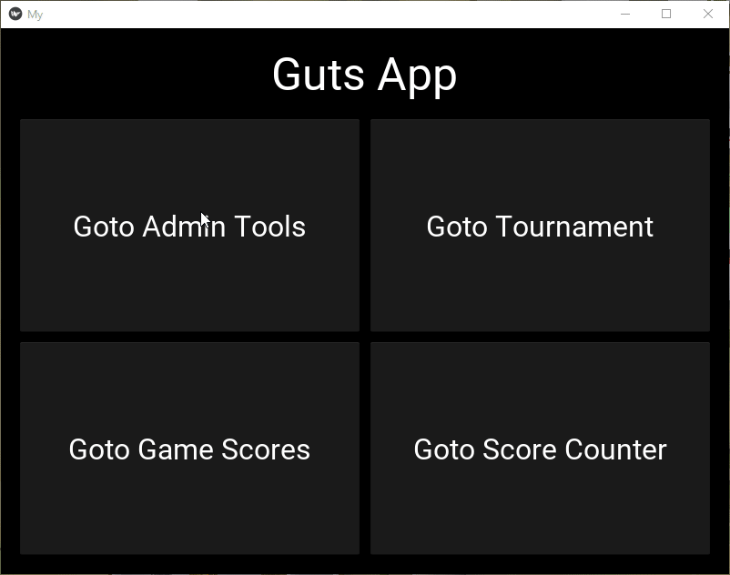

# Guts App

Guts App is a tournament management application designed for organizing and tracking Guts games. It provides features to manage teams, record match scores, track tournament progress, and view match history.

## Features

- **Team Management:** Add and remove teams participating in the tournament.
- **Score Tracking:** Record match scores and update the tournament bracket accordingly.
- **Tournament Progress:** Track the progress of the tournament through different rounds and stages.
- **Match History:** View the history of completed matches and their scores.
- **User Interface:** User-friendly interface for easy navigation and interaction.

## Installation

1. Clone the repository to your local machine.
2. Install the required dependencies using `pip install -r requirements.txt`.
3. Run the application using `python main.py`.

## Usage

1. Launch the application.
2. Use the provided screens and buttons to navigate and interact with the app.
3. Follow the on-screen instructions to manage teams, record scores, and view tournament information.

## Screenshots

## Contributing

Contributions to Guts App are welcome! If you find any issues or have suggestions for improvements, feel free to open an issue or submit a pull request.

## License

This project is licensed under the MIT License.

## Acknowledgements

- [Kivy](https://kivy.org) - Open-source Python framework for developing multitouch applications.

## Contact

For any inquiries or feedback, please contact me.

